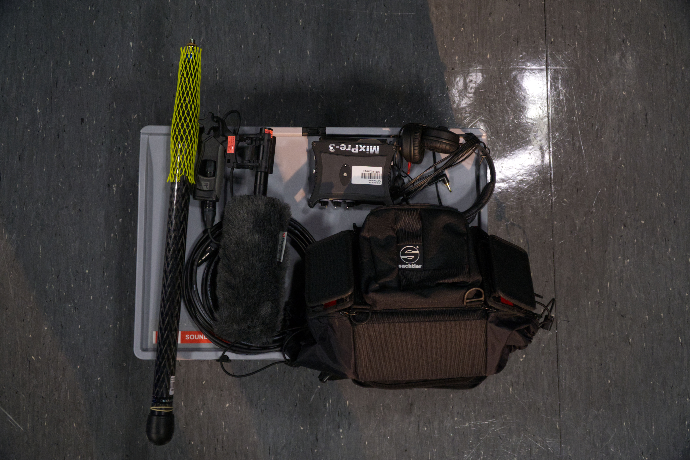

# AV-Tutorium Sommersemester 2021
### Audio
---

## Einleitung und Begrüßung
<iframe width="100%" height="470px" src="https://www.youtube-nocookie.com/embed/Ahox8ML_m6U" frameborder="0" allow="accelerometer; autoplay; clipboard-write; encrypted-media; gyroscope; picture-in-picture" allowfullscreen></iframe>

## Teil 1: Audiohardware
### Peters Auftrag
An eurem ersten Praktikumstag bekommt ihr einen Anruf eures Kollegen, welcher ein Interview mit dem Betreiber der neuen Craft-Beer-Spelunke in Furtwangen-Zentrum drehen will. Das eigentliche Produktionsteam ist durch die Verkostung am Vortag heute leider Arbeitsunfähig. Somit müsst ihr einspringen. Da Peter auf einer außerordentlich renommierten Filmhochschule war, die leider nur wenig bis keinen Wert auf Audio legte, muss er sich in diesem Punkt auf eure Kompetenz verlassen.
> "Sagemo hesch du net son Ton-Zeug im Schtudium ka? Würdsch du dich da drum kümmere?“

Du nimmst natürlich dankend an um einen guten Eindruck zu hinterlassen.
Folgendes Equipment ist alles was das Produktionsteam zurückgelassen hat:

Zuletzt gibt dir Peter noch mit auf den Weg, er wolle sowohl die Stimme des Interviewten klar hören, als auch die Umgebungsatmosphäre der kleinen Spelunke mit einfangen!
#HILF PETER

## Teil 2: Audioschnitt
### Peter wendet sich erneut an euch
Einige Wochen später… Das Produktionsteam ist bei einer weiteren Eskapade in Barcelona versumpft und nicht aufzufinden. Daher bleibt leider auch die Post-Produktion an euch hängen. Folgende Dateien konnte Peter beim Dreh sichern und euch zur Verfügung stellen:

* [Paket 01 - VO_01 - Craftbeer](./files/VO_01_Craftbeer.zip)
* [Paket 02 - VO_02 - Spelunke](./files/VO_02_Spelunke.zip)
* [Paket 03 - VO_03 - Stupedia-Student](./files/VO_03_Stupedia_Student.zip)
* [Abelton Set](./files/AV-Tutorium_VOs_Project.zip)
* [Beilspiel Abmischung - Radiomoderator](./files/AV-Tutorium_Beispiel_Radiostimme.wav)

Infos zu den Dateien:

Zur verfügung stehen 3 "Arbeitspakete" in Aufsteigender Schwierigkeit, Bestandteil der Pakete ist je eine Rohaufnahme und der gesprochene Text. Bei VO_01 handelt es sich um eine Aufnahme mit sehr wenigen Versprechern direkt ins Mikro eingesprochen. VO_02 enthält schon mehr Versprecher und Gestückelte Sätze. In VO_03 sind viele Gestückelte Sätze enthalten, außerdem ändert sich die Position des Sprechers zum Mikrofon ab und an und der Pegel ist nicht konstant.
Aufgabe ist es die Rohaufnahme vom Grundrauschen zu befreien, Versprecher zu entfernen, den Pegel anzupassen usw.

Folgende Anweisungen hast du von Peter zum Sound bekommen:
> „Also Kerle jetzt gugsch a mo das selle Stimm weng meh nach vorne kunt und’s generell weng meh fetzet dued“

Auf Hochdeutsch bedeutet das: Die Stimme des Sprechers soll ausgewogen und prägnant klingen, darüberhinaus möchte Peter, dass das Ambiente der Craft-Beer-Spelunke rüberkommt. 

---

## Linkliste
* [Mail and die Tutoren](mailto:av-praktikum@hs-furtwangen.de)
* [Dokument zur Gruppeneinteilung](https://bit.ly/av-praktikum-anmelden)
* [Abelton Trail Link](https://www.ableton.com/de/trial/)
* [Abgabe Folder](https://drive.google.com/drive/folders/1Rw0Vp_zn1m5loSgZrr1aL-UbCN7OgBa9?usp=sharing)